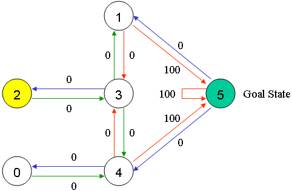

## q-learning-sample

real code for [Q-Learning-Tutorial](http://mnemstudio.org/path-finding-q-learning-tutorial.htm)


## Env

## room map


room 5 is the goal room. Once enter room 5, got reward 100

### state machines



### reward matrix


* `-1` means the way can't be happen
* `0` or `100` means reward

## Experiment

after 1000 episode, q_matrix become

```
[[  0   0   0   0 396   0]
 [  0   0   0 316   0 496]
 [  0   0   0 316   0   0]
 [  0 396 252   0 396   0]
 [316   0   0 316   0 496]
 [  0 396   0   0 396 496]]
```

use this q_matrix, we can get how to reach room 5